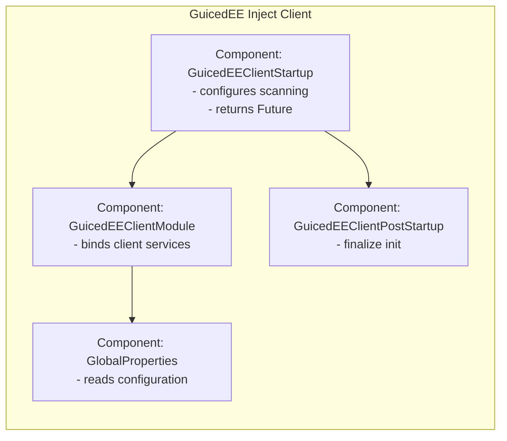

## C4 — Level 3: Component (Client Library)

```mermaid
flowchart TB
  subgraph ClientLib[GuicedEE Inject Client]
    direction TB
    Startup[Component: GuicedEEClientStartup\n- configures scanning\n- returns Future<Boolean>]
    PostStartup[Component: GuicedEEClientPostStartup\n- finalize init]
    Module[Component: GuicedEEClientModule\n- binds client services]
    GlobalProps[Component: GlobalProperties\n- reads configuration]
  end

  Startup --> Module
  Module --> GlobalProps
  Startup --> PostStartup
```

Notes
- Focuses on key components visible in the client library’s public lifecycle.
