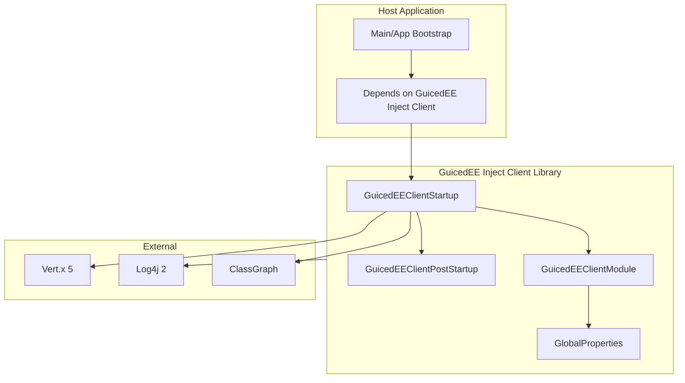

## C4 — Level 2: Container Diagram (GuicedEE Inject Client)

```mermaid
flowchart TB
    subgraph HostApp[Host Application]
      direction TB
      Main[Main/App Bootstrap]
      UsesClient[Depends on GuicedEE Inject Client]
    end

    subgraph ClientLib[GuicedEE Inject Client Library]
      direction TB
      Startup[GuicedEEClientStartup]
      PostStartup[GuicedEEClientPostStartup]
      Module[GuicedEEClientModule]
      Utils[GlobalProperties]
    end

    subgraph External
      Vertx[Vert.x 5]
      Log4j[Log4j 2]
      ClassGraph[ClassGraph]
    end

    Main --> UsesClient
    UsesClient --> Startup
    Startup --> PostStartup
    Startup --> Module
    Module --> Utils
    Startup --> Vertx
    Startup --> ClassGraph
    ClientLib --> Log4j
```

Notes
- The library exposes lifecycle hooks and a Guice module; it leverages Vert.x for futures and ClassGraph for scanning.
