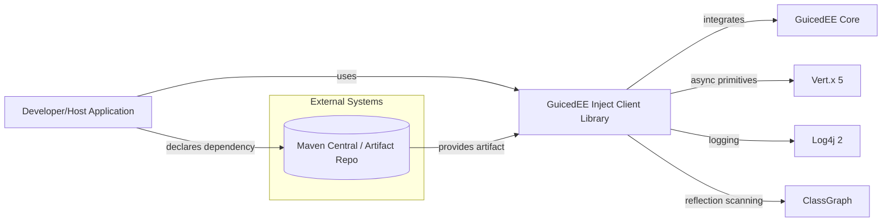

## C4 — Level 1: System Context (GuicedEE Inject Client)

```mermaid
flowchart LR
    user[Developer/Host Application] -->|uses| client[GuicedEE Inject Client Library]
    client -->|integrates| guicedee[GuicedEE Core]
    client -->|async primitives| vertx[Vert.x 5]
    client -->|logging| log4j[Log4j 2]
    client -->|reflection scanning| classgraph[ClassGraph]
    subgraph External Systems
      repo[(Maven Central / Artifact Repo)]
    end
    user -->|declares dependency| repo
    repo -->|provides artifact| client
```

Notes
- The Inject Client is a library consumed by host applications; it configures scanning and lifecycle hooks.
