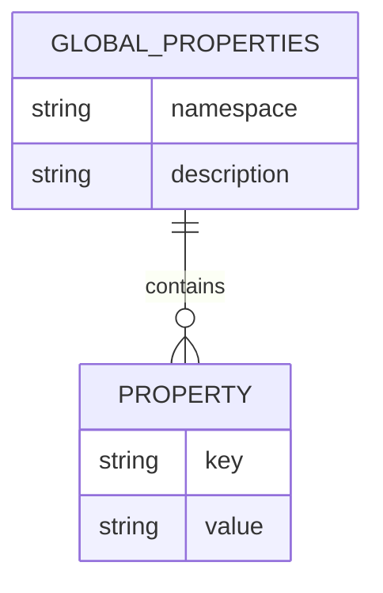

## ERD — Core Domain (Initial Draft)

```mermaid
erDiagram
    GLOBAL_PROPERTIES ||--o{ PROPERTY : contains
    GLOBAL_PROPERTIES {
        string namespace
        string description
    }
    PROPERTY {
        string key
        string value
    }
```

Notes
- Represents a conceptual view of configuration properties accessed via GlobalProperties. Refine as concrete schemas emerge.
