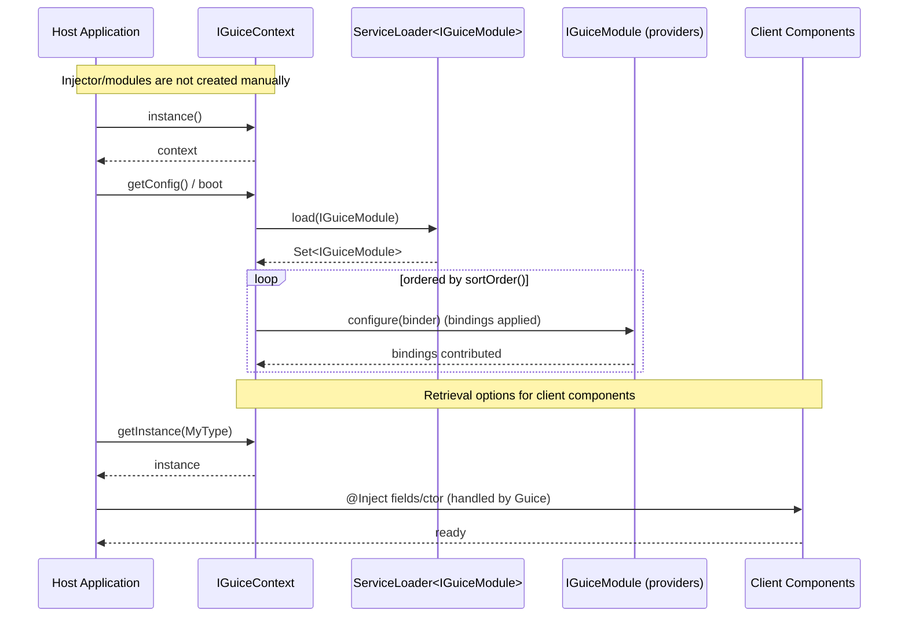

## Sequence — Client Injection (SPI-based)

Notes
- Modules are discovered via ServiceLoader as IGuiceModule and applied by GuiceContext in sortOrder() sequence; no createInjector(new Module()) here.
- Client components can be obtained via IGuiceContext.getInstance(...) or by using @Inject.
- Pre/Post startup services are also discovered and may be grouped by sortOrder for execution.
