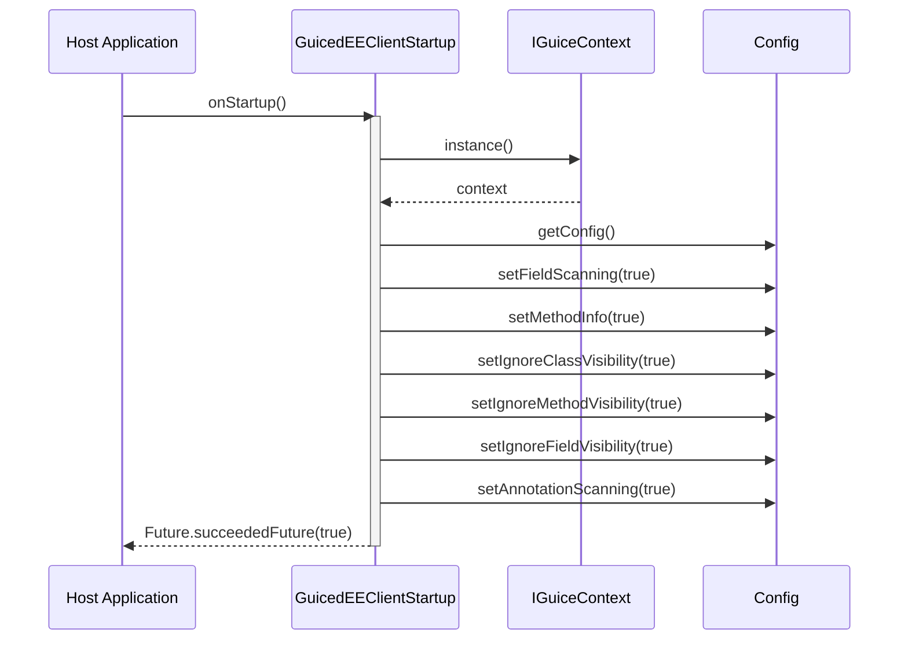

## Sequence — Client Startup

Notes
- Mirrors implementation in com.guicedee.client.implementations.GuicedEEClientStartup.
- Pre and Post startup services can be grouped and executed deterministically using sortOrder() values.
