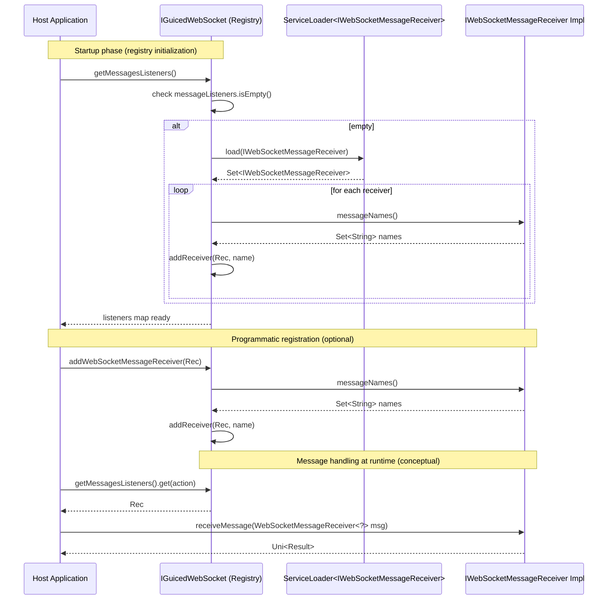

## Sequence — WebSocket Receiver Discovery and Registration

Notes
- Mirrors logic in IGuicedWebSocket: addWebSocketMessageReceiver, getMessagesListeners, loadWebSocketReceivers, addReceiver.
- Receivers declare supported actions via messageNames(); messages are handled asynchronously with Mutiny Uni.
- This is client-side SPI wiring; no WebSocket server is hosted in this module.
